# Startup Role Management Project for Asp.Net Core 3.1  with PostGRE - perfect for deployment in Linux Server

This application is created with [ASP.Net Core 3.1](https://dotnet.microsoft.com/download/dotnet-core/3.1) and [PostGRE SQL](https://www.postgresql.org/download/) (any version, tested with v11-v13). This project is a perfect startup place for a project targetting to deploy in Linux server. HTML, CSS, JS minifire all are configured in the project for better performance.

## Easy Run and Deploy with Requirements

To run this project, [CLI](https://www.c-sharpcorner.com/article/net-core-cli2/) can be enough, but [Visual Studio](https://visualstudio.microsoft.com/vs/) is recommanded because it offers various features to devs.

### Prerequisite

1. [ASP.Net Core SDK](https://dotnet.microsoft.com/download/dotnet-core/3.1)
2. [PostGRE SQL Server](https://www.postgresql.org/download/), tested with 11+, should work with any version
3. [Visual Studio 2019](https://visualstudio.microsoft.com/vs/)

### Running with VS

To run this project with [Visual Studio 2019](https://visualstudio.microsoft.com/vs/), you need to install the dotnet SDK in PC and a PostGRE connection string (connection string comes from PostGRE server which can exists in dev PC or remote server). After having both, you need to change [this line in code](./appsettings.json#L3) with your connection string. Then if you build and run the code, everything would be OK.

To apply the migration, you need to run migration update command in package manager console. The command is-

	Update-Database

To get the package manager console, you need to go here in **VS 2019**-

- ***Tools*** -> *Library Package Manager* -> *Package Manager Console* 

Most common migration commands are added in this project and can be found in [here](./.doc/Links_and_Commands.md).

## CSS and JS library with bundling and minification

Minimal configuration and easy to deploy library manager, bundler and minifire is used in this project which can be easily deployed in linux along with windows easily with zero configuration.

### Library management with Libman with different source
All CSS and JS library are managed by [libman](https://docs.microsoft.com/en-us/aspnet/core/client-side/libman/libman-vs?view=aspnetcore-3.1) which is one of the bset option for managing client side libraries. The file can be found in [here](./libman.json) and look like this-
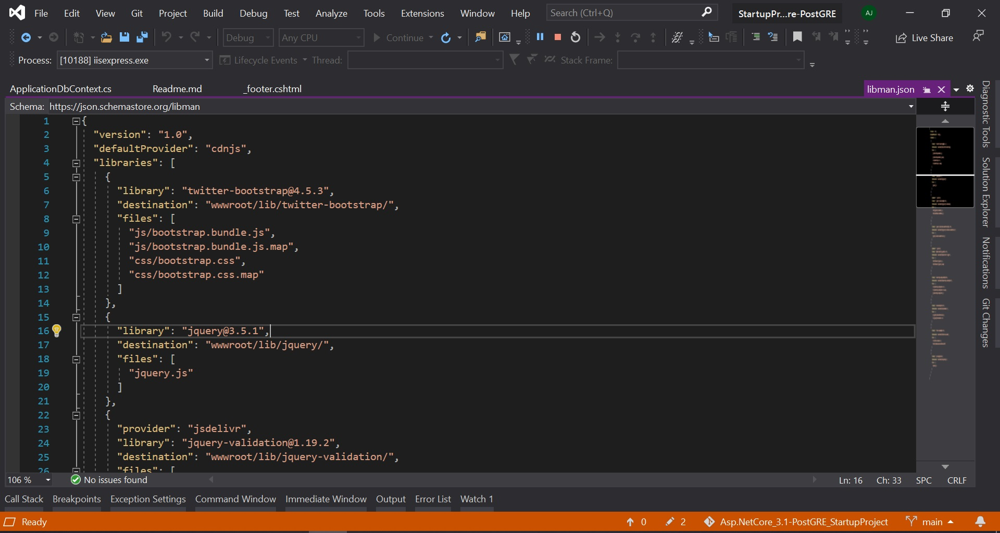
where default provider is set to ***cdnjs*** and can be set to anything like ***jsdelivr*** or anything. All file download directory is set and only required files are downloaded, so list of required files are found from the included file in the [libman.json](./libman.json) file.
No custom CSS and no custom JS are applied

### Bundling and Minification

Bundling and minification is configured with [this](./bundleconfig.json) file which is very easy to configure and used. More can be found in [here](https://docs.microsoft.com/en-us/aspnet/core/client-side/bundling-and-minification?view=aspnetcore-3.1). The file is looking like this-

which generates a css file named **site.min.css** and a js file named **site.min.js** which includes all CSS and js file compliation including all libraries.

In the project, there is stored 1 custom CSS file can be found in [here](./wwwroot/css/site.css) and one custom js fle can be found in [here](./wwwroot/js/site.js) which is also configured with bundler and minifire. No code is added in the 2 file because of providing freedom to the developer who wishesh to use this project and customize it on his demand. AS well this 2 file is added to the bundler so that a developer who forks this repo, can know how to configure his own repo. And finally, version number is appended with the CSS and JS so that CSS and JS caching issue can't happen because after each build, browser will treat every CSS and JS as new one.

## Database and Migration with Seed

PostGRE SQL is used because it is most robust open source database having support for both relational DB and text based DB. In this project I am using the DB as a relational DB. The configuration of the database can be done from [here](/appsettings.json#L3) so that anyone can configure individual DB for both deployment and development.

### Migration
All migration files are configured to be stored in [this](./Data/ApplicationDbContext.cs) folder. Useful migration commands can be found from [here](./.doc/Links_and_Commands.md).

### Seed

Seeds are configured in [here](/Data/Seeds/SeedController.cs#L19). After adding a seed, you need to run this command-

	Add-Migration <Seed_Migration_Name>
	Update-Database

Replace `<Seed_Migration_Name>` with your seeder-migration name.

Default Superadmin set with seeder is-

- ***Username*** - `abrar@jahin.com`
- ***Password*** - `abrar@jahin.com`

## Authentication and Authorization

In this project Role based authintication is implemented. 

In this project, Role based authontication is implemented and some specific roles are created depending on an enum defined in [here](./Data/Enums/EClaims.cs). And also Any user can be assigned with any role and a user can have multiple roles. Moreover, the filtering based on different places are applied in following places-

1. Controller Level can be found in [here](./Controllers/SuperAdmin/RoleManagerController.cs#L11)
2. Action level can be found in [here](./Controllers/HomeController.cs#L30)
3. Razor page sections can be filtered with role can be found in [here](./Views/Shared/LayoutPartial/_navigator.cshtml#L27)
4. Add *multiple roles* on a *Cntroller*/*Action*/*Razor page* can be found in [here](./Controllers/HomeController.cs#L30)
5. Username change limit added and set limit to 10 by default
6. 2FA with Google authinticator is added
Custom [attributes are defined in here](./Attributes/AuthorizeRolesAttribute.cs#L11) which is used to convert *enum* to attribute.

## Application UI and Screen Shots

All forms has front end and back end validation at a same time. 

0. Landing Page 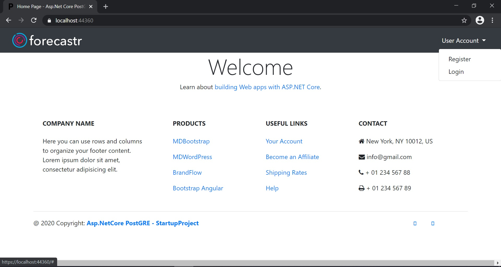
1. Registration page 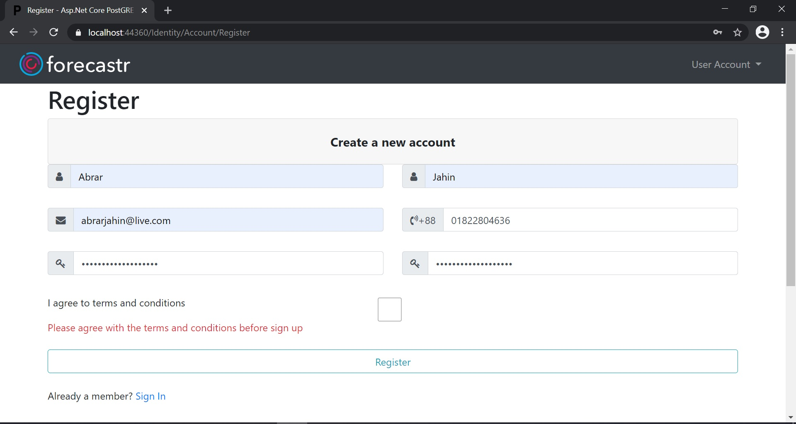
2. Login page 
3. Normal User View 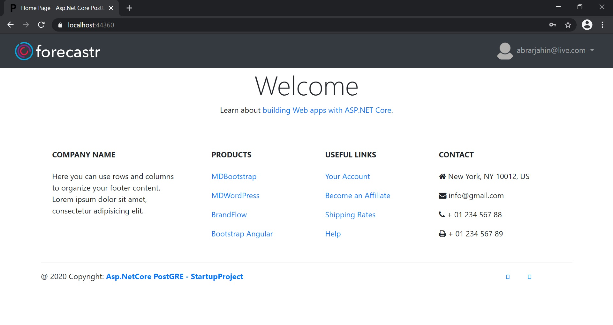
4. Super-Admin User View 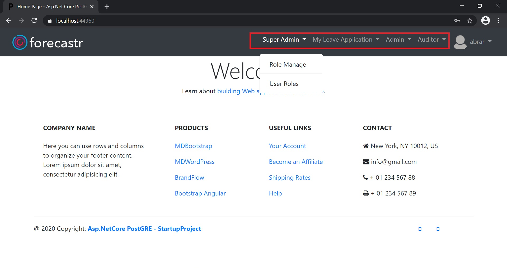
5. Access Denied page for any unauthorised access 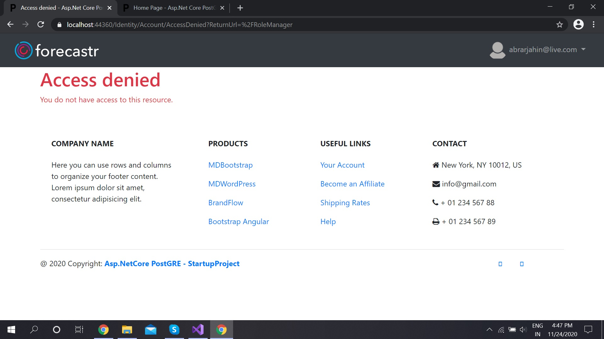
6. 2FA for user 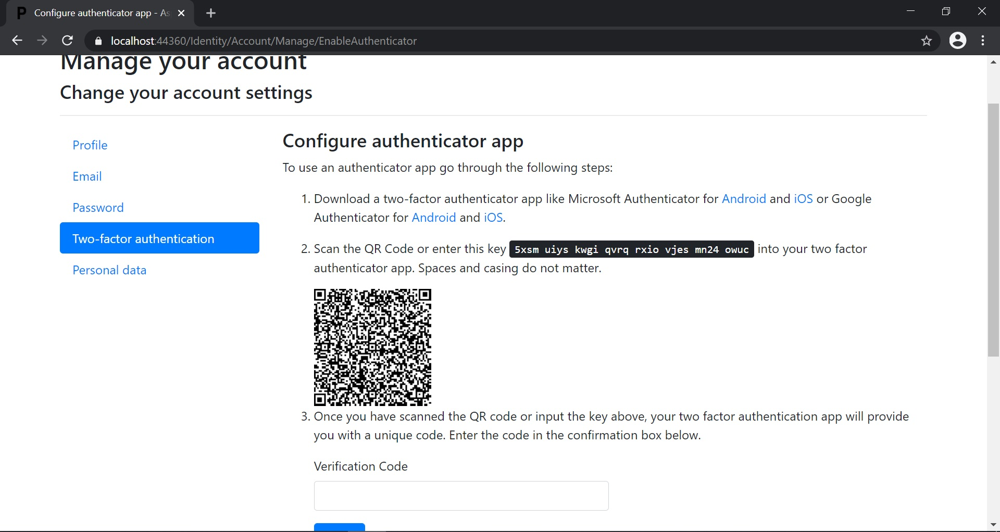
7. Profile Page 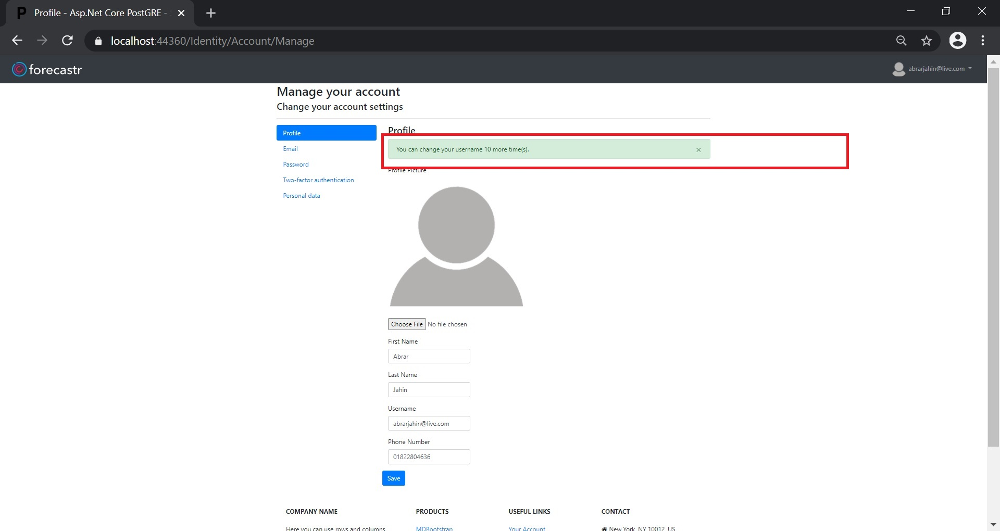
8. Role Page 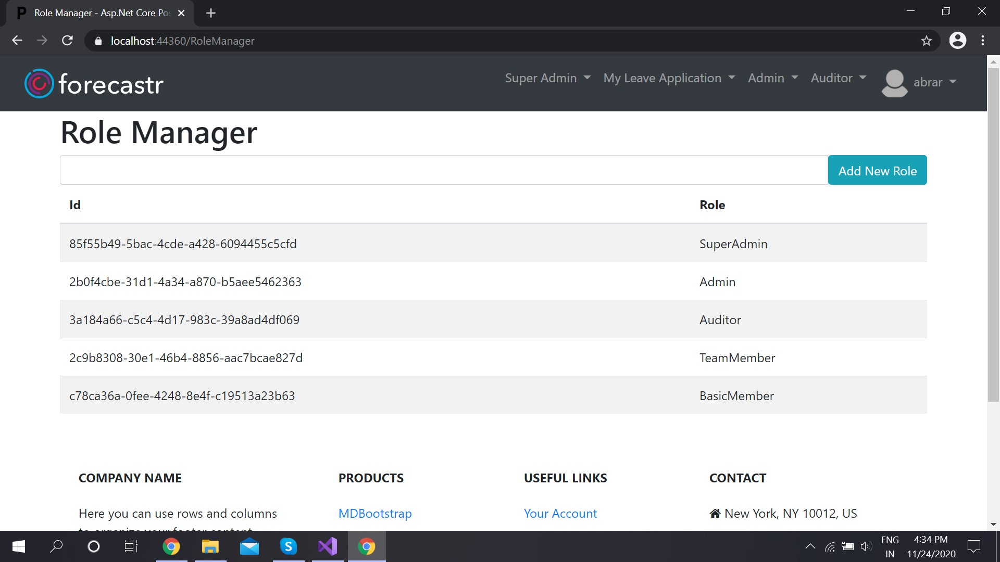
9. User-Role Management Page 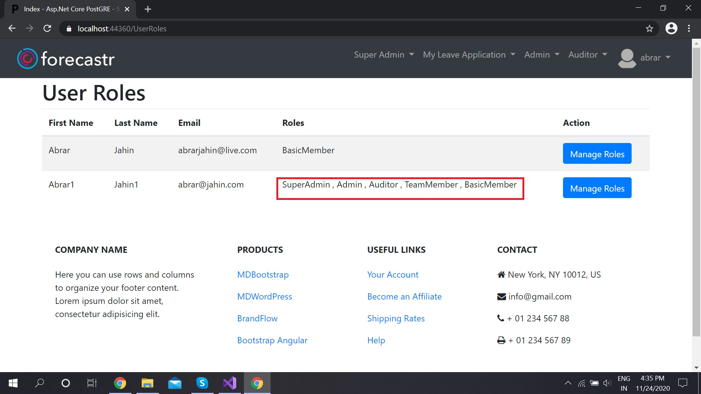 and 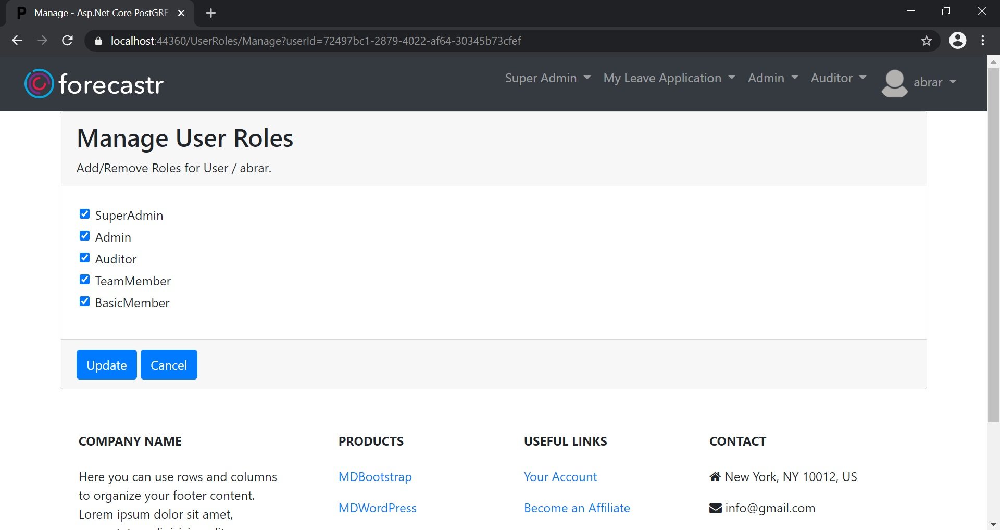

and basic operation pages.

## Some important partials

1. Header partial are seperated and can be found in [here](./Views/Shared/LayoutPartial/_header.cshtml)
2. Footer partial are seperated and can be found in [here](./Views/Shared/LayoutPartial/_footer.cshtml)
3. Navbar partial are seperated and can be found in [here](./Views/Shared/LayoutPartial/_navigator.cshtml)